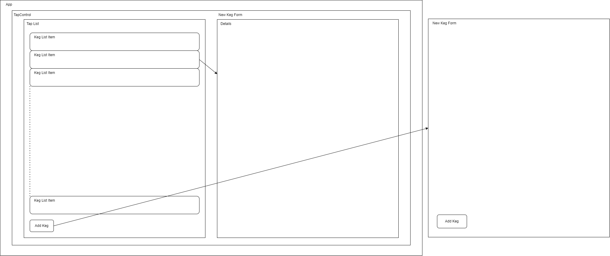

# Tap Room

#### By William Rodriguez

## Technologies Used

* React
* HTML
* CSS
* Bootstrap
* JavaScript
* npm
* Node
* webpack
* Babel
* ESLint

## Description

A web-app that keeps track of a bar's keg related information, e.g. what kegs they have, how much is in each keg, each brand, etc.

## Setup/Installation Requirements

* Clone this repository to your desktop or any directory of your choice
  * Run the command below in a bash terminal with [git](https://github.com/git-guides/install-git) installed
```
git clone https://github.com/WillRod42/currency.git
```
* Or download as a zip file
  * Click the green code button on the repository page
  * At the bottom of the popup window select `Download ZIP`
  * Extract the downloaded .zip folder
* Open the top level folder of the downloaded repsoitory
* Open bash terminal in this directory with [node](https://nodejs.org/en/download/) installed
* run `npm install` and afterwards `npm start` to host a local, live version of this web-app

## Component Diagram


## Known Bugs

* None

## License

MIT

Copyright (c) 2022 William Rodriguez